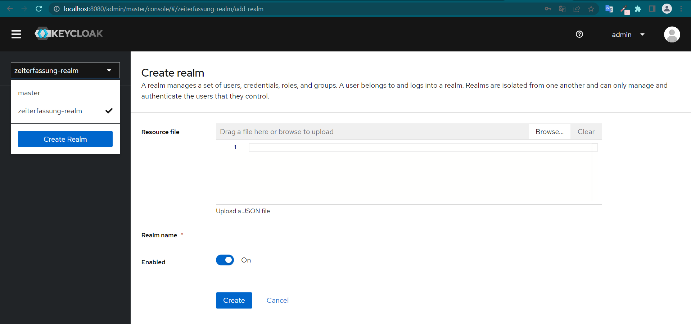
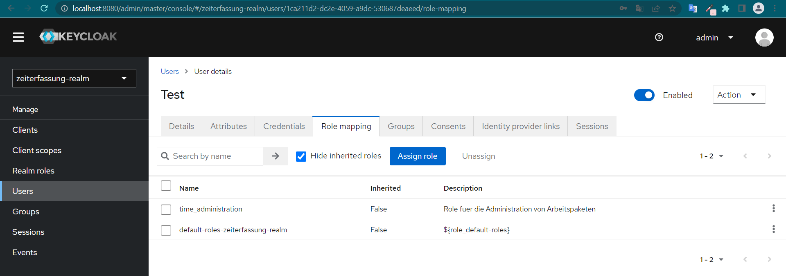
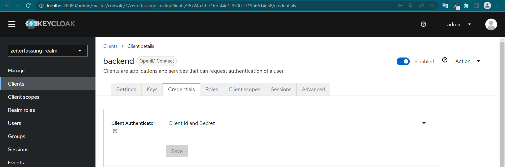

# Zeiterfassungssysten (Backend)

Das Backend des Zeiterfassungssystems verwendet Quarkus als Java-Framework

Informationen über Quarkus erhält man auf folgender Webseite: https://quarkus.io/ .

Das Backend-Projekt baut auf Java 19 auf. Daher sollte diese Version verwendet
werden (https://jdk.java.net/19/).

Zur Entwicklung als auch für den Start wurde IntelliJ als Entwicklungsumgebung verwendet.

Um das Backend zu starten muss vorher eine PostgreSQL-Datenbank und ein Keycloak-Server erstellt und
gestartet werden. Die Einrichtung wird im folgenden erklärt.

## PostgreSQL-Datenbank

Für die Einrichtung eines PostgreSQL-Datenbank empfiehlt es sich, Docker zu verwenden. Alternativ lässt sich auch ein
Application
Server verwenden (https://www.postgresql.org/download/). In Docker lässt sich mit einem einfachen Kommando ein Container
mit einer PostgreSQL-Datenbank
starten (https://hub.docker.com/_/postgres). Folgende Einstellung sollten bei der Einrichtung vorgenommen werden:

* Name: `db_zeiterfassung`
* User: admin
* Passwort: admin
* Port: 5432

Mit folgendem Docker-Befehl wird das neuste Image gezogen:

``` bash
docker pull postgres
```

Es empfiehlt sich über Docker Desktop anhand des neuen PostgreSQL-Image einen Container zu starten. Alternativ lässt
sich folgender Befehl verwenden:

``` bash
docker run --name db_zeiterfassung -e POSTGRES_USER=admin POSTGRES_PASSWORD=admin -d postgres
```

Der gestartete Container sollte nun erreichbar sein. Die Verbindungsdaten liegen im `application.properties` und sollten
mit der Datenbank übereinstimmen. Bei Abweichungen müssen Anpassungen vorgenommen werden.

``` js
# Datenbank-Konfiguration
quarkus.datasource.jdbc.url = jdbc:postgresql://localhost:5432/db_zeiterfassung
quarkus.datasource.username = admin
quarkus.datasource.password = admin
quarkus.datasource.db-kind = postgresql
```

Weitere Konfigurationen sind nicht notwendig. Das Backend sollte sich beim Start automatisch mit der Datenbank verbinden
und die entsprechenden DB-Tabellen anlegen.

## Keycloak-Server

Auch Keycloak kann über Docker gestartet werden, siehe https://www.keycloak.org/getting-started/getting-started-docker.

Mit folgendem Befehl lässt sich ein Keycloak-Container über Docker starten:

``` bash
docker run -p 8080:8080 -e KEYCLOAK_ADMIN=admin -e KEYCLOAK_ADMIN_PASSWORD=admin quay.io/keycloak/keycloak:21.0.1 start-dev
```

Zur einfacheren Einrichtung wurde eine vorhandene Realm-Konfiguration unter `src/main/resources` hinterlegt ("
zeiterfassung-realm.json). Um diese zu
importieren, muss man sich zuerst als Admin in das Keycloak UI (Url: http://localhost:8080/admin/, User: admin,
Passwort: admin) anmelden. Über die Linke Select-Box muss im nächsten Schritt ein Real erstellt werden (Create-Realm
Button). Hier lässt sich die hinterlegte Konfiguration importieren (Über "Resource File") und das Zeiterfassung-Realm
erstellen.


Da ein Import nicht ganz fehlerfrei abläuft, müssen ggf. Anpassungen vorgenommen werden.
So muss man beispielsweise eigene Testuser erstellen und ihnen Rollen zuweisen (time_administration), damit diese
sich einloggen können und Zugriff auf alle Funktionen des Zeiterfassungssystems erhalten.


Des Weiteren muss für das Backend ein neues Client Secret generiert und im `application.properties` hinterlegt werden,
da das importierte Secret nicht gültig ist. Dies lässt sich wie folgt umsetzen:

* Im Keycloak UI unter "Clients" in das `backend`-Client gehen. Im Reiter Credentials muss nun bei "Client Secret" ein
  neues Secret generiert werden.
  
* Das generierte Secret muss nun im `application.properties` hinterlegt werden:

``` js
quarkus.oidc.credentials.secret=<Generierte-Secret>
```

Nachdem alles eingerichtet wurde sollte das Frontend sowie Backend startbar sein. Es sollte möglich sein, einen neuen
User über die Standartregistrierung zu erstellen. Hierfür wurde eine Telekom-Mail eingerichtet, mit der eine E-Mail
Kommunikation möglich wird. Nach erfolgreicher Registrierung sollten gewünschte Rollen über das Keycloak UI zugeordnet
werden. Auch das Social Login über Github sollte möglich sein. Ein vorhandener
User kann sich über das Frontend einloggen und erhält vom Backend valide Antworten.

## Starten des Backends in Dev-Modus

Nachdem die Datenbank sowie der Keycloak-Server eingerichtet und gestartet worden sind, lässt sich im weiteren Verlauf
das
Backend starten. Dies lässt sich entweder in der Entwicklungsumgebung über einen klassischen Launcher oder mit
folgendem Befehl in der Konsole starten:

```shell script
./mvnw compile quarkus:dev
```

Das Backend startet auf Port 8081 und sollte nun das Speichern sowie Laden von Zeiterfassungen sowie Arbeitspakete
ermöglichen.

Fragen oder Probleme können über folgende Mail kommuniziert werden:

twardoch.thomas@fh-swf.de

